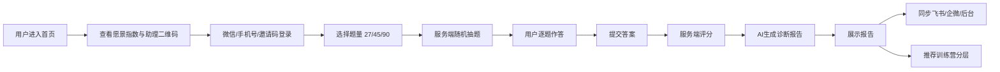

# AI交易人格测评系统 2.0 正式版

版本：V2.0 正式开发蓝图  
定位：从“网页 MVP”升级为“可登录、可测评、可生成报告、可沉淀数据、可私域承接、可安全防护”的正式测评系统。  
合规边界：本系统用于交易认知教育、行为觉察、训练分层与用户承接，不提供任何股票推荐、买卖建议、收益承诺或代客理财服务。

---

## 一、2.0 核心目标

### 1. 产品目标

把当前网页 MVP 升级为一个正式可运营系统：

1. 用户可以通过微信、手机号、邀请码登录。
2. 系统根据用户选择，从 720 道题库中随机抽取 27/45/90 道题。
3. 用户完成作答后，服务端自动评分，识别主人格、副人格、风险等级、亏钱场景、训练能力与训练营分层。
4. 系统生成专属 AI 诊断报告，并保存为可追踪的报告记录。
5. 报告结果同步到飞书、企微或运营后台，便于老师/助理后续跟进。
6. 首页展示愿景指数：注册人数、测评人数、报告份数、助理承接人数。
7. 题库、评分规则、报告模板不暴露在前端，提升防爬虫、防复制能力。

### 2. 商业目标

2.0 不是单纯测评工具，而是私域转化入口：

1. 直播间/短视频用户通过测评进入系统。
2. 测评完成后获得“很懂我”的诊断报告。
3. 报告引导添加助理、进入社群或领取训练建议。
4. 系统根据人格类型推荐训练营分层。
5. 后台沉淀用户画像，用于直播复盘、内容选题、训练营招生和续费。

### 3. 用户心智目标

用户进入系统时要感受到：

1. 这不是随便娱乐测试，而是一次交易行为内观。
2. 报告不是标签化评价，而是把自己的亏损惯性讲清楚。
3. 系统不承诺赚钱，但能帮助自己看见重复犯错的原因。
4. 添加助理不是被销售，而是为了拿到报告、训练建议和后续陪跑。

---

## 二、用户流程

### 1. 标准用户链路



### 2. 首次访问流程

1. 用户打开首页。
2. 页面展示：
   - 品牌愿景：影响 1 亿股民，建立稳定交易人格。
   - 统计指数：注册人数、测评人数、报告份数、助理承接人数。
   - 助理二维码：提示“先添加，再测评”。
   - 登录入口：微信绑定、手机号、邀请码。
3. 用户登录后进入测评页。
4. 登录信息进入数据库，记录来源渠道。

### 3. 测评流程

1. 用户选择题量：
   - 27 题：轻量版，每种人格 3 题。
   - 45 题：标准版，每种人格 5 题。
   - 90 题：深度版，每种人格 10 题。
2. 前端请求服务端抽题接口。
3. 服务端按人格类型和子维度分层随机抽题。
4. 前端只展示本次抽到的题，不展示完整题库。
5. 用户逐题选择 1-5 分。
6. 提交后服务端生成评分结果。
7. 服务端调用 AI 报告生成模块。
8. 报告入库并返回给前端展示。

### 4. 运营承接流程

1. 用户完成报告后，系统生成一条线索。
2. 线索同步到飞书多维表格或运营后台。
3. 助理看到：
   - 昵称/手机号/微信标识
   - 来源渠道
   - 主人格
   - 副人格
   - 风险等级
   - 推荐训练营
   - 报告链接
4. 助理根据人格类型发送不同话术。
5. 后续转化到训练营、直播复听、社群陪跑或课程产品。

---

## 三、2.0 功能需求

### 1. 首页与登录

#### 必须有

1. 品牌首屏：知行合一交易人格院。
2. 助理二维码：支持替换为真实企微/微信二维码。
3. 愿景区：影响 1 亿股民建立稳定交易人格。
4. 指数图：
   - 注册学员数
   - 完成测评数
   - 生成报告数
   - 助理承接数
5. 登录方式：
   - 微信登录/绑定
   - 手机号验证码登录
   - 邀请码登录

#### 后台可配置

1. 首页愿景文案。
2. 首页统计数字是否展示真实值或展示值。
3. 助理二维码图片。
4. 渠道来源参数。
5. 邀请码有效期和使用次数。

### 2. 用户系统

#### 用户身份

1. 每个用户生成唯一 `user_id`。
2. 支持一个用户绑定多个身份：
   - 微信 openid/unionid
   - 手机号
   - 邀请码
3. 用户可以重复测评，但每次生成新的 `assessment_id`。
4. 用户可以找回历史报告。

#### 登录规则

1. 微信登录优先。
2. 手机号验证码 5 分钟有效。
3. 短信验证码同手机号 60 秒内不能重复发送。
4. 邀请码可设置次数、渠道和过期时间。
5. 登录后由服务端写入 `HttpOnly + Secure + SameSite` Cookie。

### 3. 抽题系统

#### 抽题规则

1. 每次测评必须覆盖 9 种人格。
2. 27 题：每种人格 3 题。
3. 45 题：每种人格 5 题。
4. 90 题：每种人格 10 题。
5. 同一用户短期内尽量不重复抽到同一题。
6. 每种人格下尽量覆盖不同子维度。
7. 平衡型作为稳定维度参与评分，不直接归入风险型人格。

#### 防复制规则

1. 前端不保存完整 720 题库。
2. 服务端只返回本次题目。
3. 题目接口需要登录态。
4. 每次抽题生成 `assessment_id`。
5. 答案提交必须带 `assessment_id`。
6. 未完成或过期的 `assessment_id` 不允许重复刷报告。

### 4. 评分系统

#### 输出结果

1. 主人格：最明显的交易模式。
2. 副人格：压力下容易暴露的问题。
3. 当前交易风险。
4. 最容易亏钱的场景。
5. 最该训练的一项能力。
6. 阳明心学提醒。
7. 7 天行动建议。
8. 训练营分层。
9. 各人格得分百分比。
10. 高分子维度 Top 3/Top 5。

#### 主副人格规则

1. 风险型人格包括：
   - 冲动型
   - 扛单型
   - 完美主义型
   - 偏执型
   - 焦虑型
   - 从众型
   - 赌徒型
   - 拖延型
2. 平衡型作为稳定维度。
3. 主人格默认取风险型人格最高分。
4. 副人格取风险型人格第二高分。
5. 若平衡型高且所有风险型都低，可显示主人格为平衡型。

#### 风险等级规则

建议初版：

| 最高风险人格百分比 | 风险等级 |
|---|---|
| >= 78 | 高风险 |
| 62 - 77 | 中高风险 |
| 46 - 61 | 中等风险 |
| < 46 | 低风险 |

### 5. AI 报告系统

#### 报告生成方式

1. 服务端先完成结构化评分。
2. 服务端把评分结果传给 AI 报告模型。
3. AI 只负责表达和个性化解释，不负责重新计算分数。
4. AI 输出必须符合固定报告结构。
5. 报告保存到数据库。

#### 报告结构

1. 测评说明与合规提醒。
2. 主人格画像。
3. 副人格画像。
4. 当前交易风险。
5. 最容易亏钱的场景。
6. 最该训练的一项能力。
7. 高分子维度。
8. 阳明心学提醒。
9. 7 天行动建议。
10. 训练营分层建议。
11. 结语与助理承接引导。

### 6. 运营后台

#### 首页数据看板

1. 今日注册人数。
2. 今日完成测评人数。
3. 今日生成报告数。
4. 今日添加助理人数。
5. 累计注册人数。
6. 累计测评人数。
7. 累计报告数。
8. 各渠道转化率。
9. 各人格分布。
10. 高风险用户列表。

#### 用户列表

字段：

1. 用户昵称。
2. 手机号。
3. 微信标识。
4. 来源渠道。
5. 最近测评时间。
6. 最近主人格。
7. 最近副人格。
8. 风险等级。
9. 推荐训练营。
10. 助理跟进状态。

#### 报告管理

1. 查看报告详情。
2. 复制报告链接。
3. 导出报告。
4. 标记已跟进。
5. 同步飞书状态。

### 7. 飞书与企微承接

#### 飞书同步字段

1. user_id
2. assessment_id
3. report_id
4. 昵称
5. 手机号
6. 微信绑定状态
7. 来源渠道
8. 主人格
9. 副人格
10. 风险等级
11. 推荐训练营
12. 报告链接
13. 创建时间
14. 跟进状态
15. 助理备注

#### 企微/微信承接

初版可以先手动二维码承接。正式版后续可接：

1. 企微活码。
2. 渠道活码。
3. 添加好友回调。
4. 用户标签自动打标。
5. 不同人格自动欢迎语。

---

## 四、数据库表结构

推荐数据库：PostgreSQL。  
原因：结构清晰、扩展性强、适合后续做统计看板和运营后台。

### 1. users 用户表

```sql
CREATE TABLE users (
  id UUID PRIMARY KEY DEFAULT gen_random_uuid(),
  nickname VARCHAR(80),
  avatar_url TEXT,
  phone VARCHAR(32),
  phone_verified BOOLEAN NOT NULL DEFAULT false,
  wechat_bound BOOLEAN NOT NULL DEFAULT false,
  source_channel VARCHAR(80),
  source_scene VARCHAR(120),
  invite_code VARCHAR(80),
  assistant_status VARCHAR(40) NOT NULL DEFAULT 'unknown',
  last_login_at TIMESTAMPTZ,
  created_at TIMESTAMPTZ NOT NULL DEFAULT now(),
  updated_at TIMESTAMPTZ NOT NULL DEFAULT now(),
  deleted_at TIMESTAMPTZ
);

CREATE INDEX idx_users_phone ON users(phone);
CREATE INDEX idx_users_source_channel ON users(source_channel);
CREATE INDEX idx_users_created_at ON users(created_at);
```

### 2. auth_identities 第三方身份表

```sql
CREATE TABLE auth_identities (
  id UUID PRIMARY KEY DEFAULT gen_random_uuid(),
  user_id UUID NOT NULL REFERENCES users(id),
  provider VARCHAR(40) NOT NULL,
  provider_user_id VARCHAR(160) NOT NULL,
  union_id VARCHAR(160),
  raw_profile JSONB,
  created_at TIMESTAMPTZ NOT NULL DEFAULT now(),
  updated_at TIMESTAMPTZ NOT NULL DEFAULT now(),
  UNIQUE(provider, provider_user_id)
);

CREATE INDEX idx_auth_identities_user_id ON auth_identities(user_id);
```

provider 示例：

| provider | 含义 |
|---|---|
| wechat_mp | 微信公众号 |
| wechat_open | 微信开放平台 |
| phone | 手机号 |
| invite | 邀请码 |

### 3. sms_codes 短信验证码表

```sql
CREATE TABLE sms_codes (
  id UUID PRIMARY KEY DEFAULT gen_random_uuid(),
  phone VARCHAR(32) NOT NULL,
  code_hash VARCHAR(160) NOT NULL,
  purpose VARCHAR(40) NOT NULL DEFAULT 'login',
  ip_address INET,
  user_agent TEXT,
  expires_at TIMESTAMPTZ NOT NULL,
  used_at TIMESTAMPTZ,
  created_at TIMESTAMPTZ NOT NULL DEFAULT now()
);

CREATE INDEX idx_sms_codes_phone_created_at ON sms_codes(phone, created_at DESC);
```

### 4. invite_codes 邀请码表

```sql
CREATE TABLE invite_codes (
  id UUID PRIMARY KEY DEFAULT gen_random_uuid(),
  code VARCHAR(80) NOT NULL UNIQUE,
  name VARCHAR(120),
  channel VARCHAR(80),
  max_uses INTEGER,
  used_count INTEGER NOT NULL DEFAULT 0,
  starts_at TIMESTAMPTZ,
  expires_at TIMESTAMPTZ,
  status VARCHAR(30) NOT NULL DEFAULT 'active',
  created_at TIMESTAMPTZ NOT NULL DEFAULT now(),
  updated_at TIMESTAMPTZ NOT NULL DEFAULT now()
);
```

### 5. question_bank 题库表

```sql
CREATE TABLE question_bank (
  id UUID PRIMARY KEY DEFAULT gen_random_uuid(),
  question_code VARCHAR(40) NOT NULL UNIQUE,
  personality_type VARCHAR(40) NOT NULL,
  nature VARCHAR(40),
  sub_dimension VARCHAR(80) NOT NULL,
  scene_tag VARCHAR(160),
  question_text TEXT NOT NULL,
  weight NUMERIC(5,2) NOT NULL DEFAULT 1,
  core_level VARCHAR(40),
  report_tag VARCHAR(120),
  training_ability VARCHAR(120),
  status VARCHAR(30) NOT NULL DEFAULT 'active',
  version VARCHAR(40) NOT NULL DEFAULT '720_v1',
  created_at TIMESTAMPTZ NOT NULL DEFAULT now(),
  updated_at TIMESTAMPTZ NOT NULL DEFAULT now()
);

CREATE INDEX idx_question_bank_type ON question_bank(personality_type);
CREATE INDEX idx_question_bank_sub_dimension ON question_bank(sub_dimension);
CREATE INDEX idx_question_bank_status ON question_bank(status);
```

### 6. assessment_sessions 测评会话表

```sql
CREATE TABLE assessment_sessions (
  id UUID PRIMARY KEY DEFAULT gen_random_uuid(),
  user_id UUID NOT NULL REFERENCES users(id),
  test_version VARCHAR(20) NOT NULL,
  question_count INTEGER NOT NULL,
  source_channel VARCHAR(80),
  status VARCHAR(30) NOT NULL DEFAULT 'started',
  selected_question_ids UUID[] NOT NULL,
  started_at TIMESTAMPTZ NOT NULL DEFAULT now(),
  submitted_at TIMESTAMPTZ,
  expires_at TIMESTAMPTZ,
  ip_address INET,
  user_agent TEXT,
  created_at TIMESTAMPTZ NOT NULL DEFAULT now()
);

CREATE INDEX idx_assessment_sessions_user_id ON assessment_sessions(user_id);
CREATE INDEX idx_assessment_sessions_status ON assessment_sessions(status);
CREATE INDEX idx_assessment_sessions_created_at ON assessment_sessions(created_at);
```

status 示例：

| status | 含义 |
|---|---|
| started | 已开始 |
| submitted | 已提交 |
| scored | 已评分 |
| reported | 已生成报告 |
| expired | 已过期 |

### 7. assessment_answers 答案表

```sql
CREATE TABLE assessment_answers (
  id UUID PRIMARY KEY DEFAULT gen_random_uuid(),
  assessment_id UUID NOT NULL REFERENCES assessment_sessions(id),
  user_id UUID NOT NULL REFERENCES users(id),
  question_id UUID NOT NULL REFERENCES question_bank(id),
  question_code VARCHAR(40) NOT NULL,
  personality_type VARCHAR(40) NOT NULL,
  sub_dimension VARCHAR(80) NOT NULL,
  score INTEGER NOT NULL CHECK (score BETWEEN 1 AND 5),
  weight NUMERIC(5,2) NOT NULL DEFAULT 1,
  answered_at TIMESTAMPTZ NOT NULL DEFAULT now(),
  UNIQUE(assessment_id, question_id)
);

CREATE INDEX idx_assessment_answers_assessment_id ON assessment_answers(assessment_id);
CREATE INDEX idx_assessment_answers_user_id ON assessment_answers(user_id);
```

### 8. score_results 评分结果表

```sql
CREATE TABLE score_results (
  id UUID PRIMARY KEY DEFAULT gen_random_uuid(),
  assessment_id UUID NOT NULL UNIQUE REFERENCES assessment_sessions(id),
  user_id UUID NOT NULL REFERENCES users(id),
  main_type VARCHAR(40) NOT NULL,
  sub_type VARCHAR(40),
  risk_level VARCHAR(40) NOT NULL,
  recommended_camp VARCHAR(80),
  training_ability VARCHAR(120),
  easiest_loss_scene TEXT,
  current_trading_risk TEXT,
  yangming_reminder TEXT,
  score_percentages JSONB NOT NULL,
  raw_scores JSONB NOT NULL,
  top_sub_dimensions JSONB NOT NULL,
  actions_7_days JSONB NOT NULL,
  created_at TIMESTAMPTZ NOT NULL DEFAULT now()
);

CREATE INDEX idx_score_results_user_id ON score_results(user_id);
CREATE INDEX idx_score_results_main_type ON score_results(main_type);
CREATE INDEX idx_score_results_risk_level ON score_results(risk_level);
```

### 9. reports 报告表

```sql
CREATE TABLE reports (
  id UUID PRIMARY KEY DEFAULT gen_random_uuid(),
  report_no VARCHAR(60) NOT NULL UNIQUE,
  assessment_id UUID NOT NULL UNIQUE REFERENCES assessment_sessions(id),
  user_id UUID NOT NULL REFERENCES users(id),
  score_result_id UUID NOT NULL REFERENCES score_results(id),
  title VARCHAR(160) NOT NULL,
  content_md TEXT NOT NULL,
  content_json JSONB,
  ai_provider VARCHAR(60),
  ai_model VARCHAR(80),
  prompt_version VARCHAR(80),
  public_token VARCHAR(120) UNIQUE,
  view_count INTEGER NOT NULL DEFAULT 0,
  copied_count INTEGER NOT NULL DEFAULT 0,
  created_at TIMESTAMPTZ NOT NULL DEFAULT now(),
  updated_at TIMESTAMPTZ NOT NULL DEFAULT now()
);

CREATE INDEX idx_reports_user_id ON reports(user_id);
CREATE INDEX idx_reports_assessment_id ON reports(assessment_id);
CREATE INDEX idx_reports_created_at ON reports(created_at);
```

### 10. lead_sync_logs 线索同步日志表

```sql
CREATE TABLE lead_sync_logs (
  id UUID PRIMARY KEY DEFAULT gen_random_uuid(),
  user_id UUID NOT NULL REFERENCES users(id),
  assessment_id UUID REFERENCES assessment_sessions(id),
  report_id UUID REFERENCES reports(id),
  target VARCHAR(40) NOT NULL,
  status VARCHAR(30) NOT NULL,
  request_payload JSONB,
  response_payload JSONB,
  error_message TEXT,
  created_at TIMESTAMPTZ NOT NULL DEFAULT now()
);

CREATE INDEX idx_lead_sync_logs_user_id ON lead_sync_logs(user_id);
CREATE INDEX idx_lead_sync_logs_status ON lead_sync_logs(status);
```

target 示例：

| target | 含义 |
|---|---|
| feishu | 飞书 |
| wecom | 企微 |
| coze | Coze |

### 11. event_logs 行为事件表

```sql
CREATE TABLE event_logs (
  id UUID PRIMARY KEY DEFAULT gen_random_uuid(),
  user_id UUID REFERENCES users(id),
  event_name VARCHAR(80) NOT NULL,
  event_properties JSONB,
  ip_address INET,
  user_agent TEXT,
  created_at TIMESTAMPTZ NOT NULL DEFAULT now()
);

CREATE INDEX idx_event_logs_user_id ON event_logs(user_id);
CREATE INDEX idx_event_logs_event_name ON event_logs(event_name);
CREATE INDEX idx_event_logs_created_at ON event_logs(created_at);
```

事件示例：

| event_name | 含义 |
|---|---|
| page_view | 页面访问 |
| login_success | 登录成功 |
| assistant_qr_view | 查看助理二维码 |
| assessment_start | 开始测评 |
| assessment_submit | 提交答案 |
| report_generated | 生成报告 |
| report_copy | 复制报告 |
| lead_synced | 同步线索 |

### 12. admin_users 后台管理员表

```sql
CREATE TABLE admin_users (
  id UUID PRIMARY KEY DEFAULT gen_random_uuid(),
  name VARCHAR(80) NOT NULL,
  email VARCHAR(160) UNIQUE,
  password_hash VARCHAR(200),
  role VARCHAR(40) NOT NULL DEFAULT 'operator',
  status VARCHAR(30) NOT NULL DEFAULT 'active',
  last_login_at TIMESTAMPTZ,
  created_at TIMESTAMPTZ NOT NULL DEFAULT now(),
  updated_at TIMESTAMPTZ NOT NULL DEFAULT now()
);
```

---

## 五、后端接口清单

统一前缀：`/api/v1`

### 1. 认证接口

#### POST `/auth/sms/send`

用途：发送手机号验证码。

请求：

```json
{
  "phone": "13800000000",
  "purpose": "login"
}
```

返回：

```json
{
  "ok": true,
  "message": "验证码已发送",
  "cooldown_seconds": 60
}
```

安全：

1. 单手机号 60 秒限频。
2. 单 IP 每小时限制发送次数。
3. 验证码只保存 hash。

#### POST `/auth/sms/login`

用途：手机号验证码登录/注册。

请求：

```json
{
  "phone": "13800000000",
  "code": "246810",
  "source_channel": "直播间",
  "invite_code": "YM2026"
}
```

返回：

```json
{
  "ok": true,
  "user": {
    "id": "uuid",
    "nickname": "138****0000",
    "phone_verified": true,
    "wechat_bound": false
  }
}
```

#### GET `/auth/wechat/url`

用途：获取微信授权登录地址。

请求参数：

| 参数 | 类型 | 必填 | 说明 |
|---|---|---|---|
| redirect_uri | string | 是 | 授权后返回地址 |
| source_channel | string | 否 | 渠道 |

返回：

```json
{
  "ok": true,
  "auth_url": "https://open.weixin.qq.com/..."
}
```

#### GET `/auth/wechat/callback`

用途：微信 OAuth 回调，创建或登录用户。

返回：服务端写 Cookie 后跳转到前端首页。

#### POST `/auth/invite/login`

用途：邀请码登录。

请求：

```json
{
  "invite_code": "YM2026",
  "nickname": "直播间学员"
}
```

返回：

```json
{
  "ok": true,
  "user": {
    "id": "uuid",
    "nickname": "直播间学员"
  }
}
```

#### GET `/auth/me`

用途：获取当前登录用户。

返回：

```json
{
  "ok": true,
  "user": {
    "id": "uuid",
    "nickname": "测试用户",
    "phone": "138****0000",
    "wechat_bound": true
  }
}
```

#### POST `/auth/logout`

用途：退出登录。

返回：

```json
{
  "ok": true
}
```

### 2. 首页统计接口

#### GET `/stats/public`

用途：首页愿景指数。

返回：

```json
{
  "ok": true,
  "target": 100000000,
  "registrations": 12860,
  "assessments": 9864,
  "reports": 7352,
  "assistant_bindings": 4218,
  "impact_index": 0.009864
}
```

说明：

1. 可以返回真实值。
2. 也可以后台配置展示值。
3. 不返回敏感用户数据。

### 3. 测评接口

#### POST `/assessments/start`

用途：开始测评，服务端随机抽题。

请求：

```json
{
  "test_version": "45",
  "source_channel": "直播间"
}
```

返回：

```json
{
  "ok": true,
  "assessment_id": "uuid",
  "test_version": "45",
  "expires_at": "2026-05-24T12:00:00Z",
  "questions": [
    {
      "question_id": "uuid",
      "question_code": "CX001",
      "personality_type": "冲动型",
      "sub_dimension": "追涨冲动",
      "question_text": "看到股票盘中突然直线拉升时，我很容易来不及分析就追进去。"
    }
  ]
}
```

注意：

1. 不返回 weight。
2. 不返回完整题库。
3. 不返回评分规则。
4. `assessment_id` 过期后不可提交。

#### GET `/assessments/:assessment_id`

用途：获取当前测评会话。

返回：

```json
{
  "ok": true,
  "assessment": {
    "id": "uuid",
    "status": "started",
    "question_count": 45,
    "answered_count": 12
  }
}
```

#### POST `/assessments/:assessment_id/submit`

用途：提交答案，服务端评分并生成报告。

请求：

```json
{
  "answers": [
    {
      "question_id": "uuid",
      "score": 5
    }
  ],
  "client_started_at": "2026-05-24T10:00:00Z",
  "client_submitted_at": "2026-05-24T10:08:00Z"
}
```

返回：

```json
{
  "ok": true,
  "assessment_id": "uuid",
  "score_result": {
    "main_type": "冲动型",
    "sub_type": "焦虑型",
    "risk_level": "高风险",
    "recommended_camp": "基础觉察营",
    "score_percentages": {
      "冲动型": 92,
      "焦虑型": 76
    }
  },
  "report": {
    "id": "uuid",
    "report_no": "YM202605240001",
    "title": "冲动型交易画像",
    "content_md": "《九种交易人格 AI 诊断报告》..."
  }
}
```

安全：

1. 校验答案数量等于抽题数量。
2. 校验 question_id 属于本次 assessment。
3. 校验 score 为 1-5。
4. 防止重复提交。
5. 对异常快答进行标记。

### 4. 报告接口

#### GET `/reports/:report_id`

用途：查看自己的报告详情。

返回：

```json
{
  "ok": true,
  "report": {
    "id": "uuid",
    "report_no": "YM202605240001",
    "title": "冲动型交易画像",
    "content_md": "...",
    "created_at": "2026-05-24T10:10:00Z"
  }
}
```

#### GET `/reports/public/:public_token`

用途：公开分享报告页。

注意：公开页要隐藏手机号、微信标识等隐私字段。

#### POST `/reports/:report_id/copy`

用途：记录复制报告事件。

返回：

```json
{
  "ok": true
}
```

#### GET `/reports/history`

用途：当前用户历史报告。

返回：

```json
{
  "ok": true,
  "reports": [
    {
      "id": "uuid",
      "report_no": "YM202605240001",
      "main_type": "冲动型",
      "risk_level": "高风险",
      "created_at": "2026-05-24T10:10:00Z"
    }
  ]
}
```

### 5. 线索同步接口

#### POST `/integrations/feishu/sync-report`

用途：把报告线索同步到飞书。

请求：

```json
{
  "report_id": "uuid"
}
```

返回：

```json
{
  "ok": true,
  "sync_id": "uuid",
  "status": "success"
}
```

说明：

1. 飞书 Webhook 或多维表格 token 必须放服务端环境变量。
2. 失败要记录 `lead_sync_logs`。
3. 支持重试。

### 6. 管理后台接口

#### GET `/admin/dashboard`

用途：后台首页统计。

返回：

```json
{
  "ok": true,
  "today": {
    "registrations": 120,
    "assessments": 89,
    "reports": 82
  },
  "total": {
    "registrations": 12860,
    "assessments": 9864,
    "reports": 7352
  },
  "personality_distribution": [
    { "type": "冲动型", "count": 2800 },
    { "type": "焦虑型", "count": 2100 }
  ],
  "channel_conversion": [
    { "channel": "直播间", "visits": 5000, "assessments": 1200 }
  ]
}
```

#### GET `/admin/users`

用途：用户列表。

查询参数：

| 参数 | 说明 |
|---|---|
| page | 页码 |
| page_size | 每页数量 |
| channel | 来源渠道 |
| main_type | 主人格 |
| risk_level | 风险等级 |
| keyword | 手机号/昵称搜索 |

#### GET `/admin/reports`

用途：报告列表。

#### GET `/admin/reports/:report_id`

用途：报告详情。

#### POST `/admin/reports/:report_id/sync-feishu`

用途：手动重试同步飞书。

---

## 六、安全与防爬虫策略

### 1. 必做

1. 题库不放前端。
2. 服务端抽题。
3. 服务端评分。
4. 服务端生成报告。
5. 接口登录鉴权。
6. Cookie 使用 `HttpOnly + Secure + SameSite=Lax/Strict`。
7. 手机号验证码限流。
8. 测评开始/提交接口限流。
9. 答案提交绑定 assessment_id。
10. 飞书、Coze、短信 Key 全部放环境变量。

### 2. 上线建议

1. CDN/WAF：Cloudflare、腾讯云 EdgeOne、阿里云 WAF 三选一。
2. 异常时验证码：Cloudflare Turnstile 或国内滑块验证码。
3. IP 风控：同 IP 短时间大量注册/测评触发拦截。
4. 设备指纹：用于识别批量刷测评。
5. 报告水印：报告编号、用户昵称、生成时间。
6. 后台审计：复制报告、导出数据、同步飞书都记录事件。

### 3. 不建议做

1. 不要只靠前端混淆 JS 保护题库。
2. 不要把 Coze Token 写到前端。
3. 不要让前端直接调用飞书 Webhook。
4. 不要用 localStorage 保存长期登录 token。
5. 不要公开完整题库 JSON 文件。

---

## 七、推荐技术架构

### 1. 低成本正式版

适合第一阶段真实上线：

| 模块 | 推荐 |
|---|---|
| 前端 | Next.js 或当前静态页升级 |
| 后端 | Node.js + Fastify/NestJS |
| 数据库 | PostgreSQL |
| 缓存/限流 | Redis |
| AI 报告 | Coze 工作流或 OpenAI API |
| 文件/二维码 | 对象存储 |
| 部署 | Vercel / 腾讯云 / 阿里云 |
| 运营同步 | 飞书多维表格 |

### 2. 第一版不要过度复杂

先不做：

1. 支付系统。
2. 完整课程后台。
3. 复杂权限系统。
4. 多租户。
5. App。

先做：

1. 登录。
2. 抽题。
3. 提交。
4. 评分。
5. 报告。
6. 飞书。
7. 后台看板。

---

## 八、分阶段搭建计划

### 第 0 阶段：确认业务口径

产出：

1. 确认 9 种人格命名。
2. 确认 27/45/90 题抽题规则。
3. 确认训练营分层名称。
4. 确认首页愿景文案。
5. 确认助理二维码。
6. 确认飞书表字段。

验收标准：

1. 老师看文案觉得顺。
2. 助理知道每种人格怎么跟进。
3. 开发知道数据库和接口怎么做。

### 第 1 阶段：后端基础与题库入库

任务：

1. 初始化后端项目。
2. 建 PostgreSQL 数据库。
3. 建表。
4. 导入 720 题库。
5. 实现 `/stats/public`。
6. 实现 `/assessments/start`。

验收：

1. 服务端可以按 27/45/90 抽题。
2. 前端拿不到完整 720 题库。
3. 同一用户短期内题目尽量不重复。

### 第 2 阶段：登录系统

任务：

1. 手机号验证码登录。
2. 邀请码登录。
3. 微信登录预留或接入。
4. Cookie 会话。
5. `/auth/me`。
6. `/auth/logout`。

验收：

1. 用户必须登录后才能开始测评。
2. 登录后可以找回历史报告。
3. 后台能看到用户来源。

### 第 3 阶段：评分与报告

任务：

1. 实现答案提交。
2. 实现评分算法。
3. 实现报告生成。
4. 报告入库。
5. 报告详情页。

验收：

1. 45 题能稳定出报告。
2. 报告字段完整。
3. 报告合规表达正确。
4. 报告能被复制/分享。

### 第 4 阶段：飞书与运营后台

任务：

1. 飞书多维表格同步。
2. 后台 dashboard。
3. 用户列表。
4. 报告列表。
5. 人格分布统计。
6. 渠道转化统计。

验收：

1. 每个报告自动进飞书。
2. 助理能按风险等级跟进。
3. 老师能看到每日测评数据。

### 第 5 阶段：安全与上线

任务：

1. 接入限流。
2. 接入 WAF/CDN。
3. 接入异常验证码。
4. 加报告水印。
5. 配置日志和告警。
6. 线上部署。

验收：

1. 题库不暴露。
2. 接口不能被随意刷。
3. 密钥不在前端。
4. 系统可稳定跑 100-500 个真实用户测试。

---

## 九、MVP 到 2.0 的具体改造清单

### 当前 MVP 保留

1. 首页高级视觉风格。
2. 助理二维码入口。
3. 愿景指数展示。
4. 27/45/90 题体验。
5. 报告展示样式。
6. Coze/飞书入口概念。

### 需要替换

| 当前 MVP | 2.0 正式版 |
|---|---|
| 前端本地题库 JSON | 服务端题库数据库 |
| 前端抽题 | 服务端抽题 |
| 前端评分 | 服务端评分 |
| 前端生成本地报告 | 服务端调用 AI 生成报告 |
| localStorage 登录 | 服务端 Cookie 登录 |
| 假二维码 | 真实企微/微信二维码 |
| 展示统计 | 数据库真实统计 |
| 前端直连飞书 | 服务端同步飞书 |

---

## 十、下一步执行建议

最建议马上做三件事：

### 第一步：确定 2.0 技术栈

建议：

1. Next.js 前端。
2. Node.js 后端。
3. PostgreSQL 数据库。
4. Redis 做限流。
5. Coze 继续做报告生成。
6. 飞书做运营后台第一版。

### 第二步：我帮你生成后端项目骨架

下一步可以直接创建：

```text
server/
  src/
    auth/
    assessments/
    reports/
    integrations/
    admin/
    db/
```

并先实现：

1. 数据库 schema。
2. 题库导入脚本。
3. 抽题接口。
4. 提交答案接口。
5. 评分函数。

### 第三步：把当前网页改成调用后端

改造顺序：

1. 登录页调用 `/auth/*`。
2. 题量选择调用 `/assessments/start`。
3. 作答提交调用 `/assessments/:id/submit`。
4. 报告页读取后端返回报告。
5. 首页指数调用 `/stats/public`。

---

## 十一、验收标准

2.0 第一版完成的标准：

1. 用户可以登录。
2. 题库不暴露在前端。
3. 可以从 720 题中抽 27/45/90 题。
4. 可以完成测评并生成报告。
5. 报告进入数据库。
6. 线索同步飞书。
7. 首页指数来自数据库。
8. 后台能查看用户、测评、报告。
9. 有基础限流和防刷。
10. 可以支持第一批 100 个真实用户测试。

